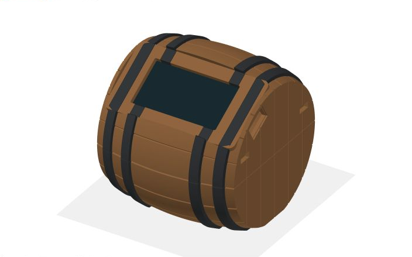

# RumScale

**[Guide de configuration et FAQ](https://pbouffaut.github.io/RumScale/)** —
première connexion, calibration, Telegram, changement de Wi-Fi, cadeau et dépannage.

Un tonneau de vieillissement posé sur une base qui le pèse. Il sait combien il
reste dedans, depuis combien de jours le rhum vieillit, et il prévient quand le
niveau baisse.

- **Écran couleur** sur le tonneau : jauge de tonneau qui se vide, niveau en %,
  jours de vieillissement et réveil par deux coups brefs sur la base. Un bouton
  optionnel permet de parcourir les pages et de remettre le vieillissement à zéro.
- **App web** servie par l'ESP32 lui-même : jauge, historique, journal des
  services, assistant d'initialisation. Aucune application à installer — ça
  s'ouvre dans le navigateur, sur iPhone comme sur Android.
- **Alertes Telegram** à chaque service et aux seuils de 50 %, 25 % et 10 %.

---

## 1. Matériel

| Élément | Détail |
|---|---|
| Carte | **ideaspark ESP32 avec écran ST7789 1,9" 170×320 intégré** (cible principale). L'ESP32 et l'écran sont sur la même carte, déjà câblés. |
| 1 × HX711 | module ampli/ADC, canal A actif dans le firmware |
| 4 × demi-cellules de charge | réunies en **un pont complet** connecté au HX711 ; configuration actuelle du tonneau de 2 L |
| Bouton optionnel | poussoir momentané, câblé vers la masse ; inutile pour le réveil par double coup et l'utilisation de l'app web |
| Base | deux plaques rigides (contreplaqué 18 mm ou alu) + entretoises + vis M4/M5 |
| Alimentation | USB 5 V, 1 A suffit |

Une variante à **deux cellules à quatre fils (deux ponts complets)** reste
possible : une cellule par HX711, soit deux modules, avec `NUM_CHANNELS` réglé
à `2` dans [config.h](src/config.h), puis recompilation et recalibration.

Deux autres combinaisons sont maintenues dans le même code, avec un écran OLED
SSD1306 0,96" I²C à la place : un ESP32-WROOM-32 nu, ou un ESP32-S3 nu (Waveshare
ESP32-S3-DEV-KIT, Freenove ESP32-S3-WROOM). Voir la section 4.

**Pourquoi un petit écran plutôt qu'une dalle 4,3"** — au-delà de l'allure, une
dalle de 4,3" tire 150 à 250 mA en permanence et réchauffe la base de quelques
degrés. Or la dérive thermique des cellules de charge est exactement ce que
l'algorithme de la section 9 passe son temps à compenser. Sur la cible ideaspark,
le rétroéclairage est d'ailleurs piloté en PWM et volontairement réglé à 170/255
(`TFT_BACKLIGHT` dans [config.h](src/config.h)).

## 2. Câblage

Tout est en 3,3 V. **N'alimente pas les HX711 en 5 V** : leur sortie DOUT
suivrait le 5 V et attaquerait les GPIO de l'ESP32 hors spécification. On perd un
peu de signal en 3,3 V, largement compensé par la résolution du HX711.

Sur la carte ideaspark, l'écran occupe déjà les GPIO 2, 4, 15, 18, 23 et 32.
Le montage actuel utilise **un HX711 : DOUT sur GPIO 25, SCK sur GPIO 26,
VCC sur 3V3 et GND sur GND**. Les quatre demi-cellules forment ensemble le pont
raccordé à ses bornes E+, E−, A+ et A− ; elles ne correspondent pas à quatre
canaux du firmware. `NUM_CHANNELS` vaut déjà `1`.

> **[Fiche de câblage](docs/cablage.html)** — raccordement du montage actif et
> schéma de la variante à deux HX711, avec sa base à deux barres à flexion.

| Signal | ideaspark (ST7789) | ESP32-WROOM + OLED | ESP32-S3 + OLED |
|---|---|---|---|
| HX711 **A** — DOUT | 25 | 16 | 4 |
| HX711 **A** — SCK | 26 | 4 | 5 |
| HX711 **B** — DOUT (option) | 16 | 17 | 6 |
| HX711 **B** — SCK (option) | 17 | 5 | 7 |
| OLED — SDA / SCL | — | 21 / 22 | 8 / 9 |
| Bouton | 27 | 27 | 10 |
| VCC des HX711 | 3V3 | 3V3 | 3V3 |
| GND | GND commun, obligatoire | | |

Pour une **cellule à quatre fils formant déjà un pont complet** (variante), le
code couleur le plus répandu est le suivant. Ce tableau ne décrit pas les
liaisons individuelles des quatre demi-cellules du montage actuel :

| Fil | Borne HX711 |
|---|---|
| rouge | E+ |
| noir | E− |
| blanc | A− |
| vert | A+ |

> Si le poids diminue quand tu appuies sur le plateau, inverse vert et blanc sur
> ce HX711. Les codes couleur varient d'un fabricant à l'autre.

Le brochage se change en haut de [config.h](src/config.h). `NUM_CHANNELS`
désigne le nombre de **modules HX711** : `1` pour le montage actuel (ou une
seule cellule à pont complet), `2` pour deux modules. Le HX711 B n'est lu que
dans ce dernier cas.

## 3. La base mécanique — la partie qui compte vraiment

Dans le montage actuel, les quatre demi-cellules doivent porter le plateau et
pouvoir se déformer, sans appui parasite ni câble tendu. Respecte le montage
mécanique prévu pour leur forme. La coupe ci-dessous décrit la **variante à
deux barres à flexion**, pas les quatre demi-cellules.

Une cellule à flexion ne mesure que si elle peut **fléchir**. Elle se monte en
porte-à-faux : une extrémité vissée sur la plaque du bas, l'autre sur la plaque
du haut, avec de l'air entre les deux.

```
        plateau (le tonneau est posé dessus)
   ═══════════════════════════════════════════
     │ entretoise            entretoise │
     ▓▓▓▓▓▓▓▓▓▓▓            ▓▓▓▓▓▓▓▓▓▓▓        <- cellules de charge
              │ entretoise │
   ═══════════════════════════════════════════
        plaque de fond (posée au sol)
```

Quatre règles, dans l'ordre d'importance :

1. **Le plateau ne doit toucher que les cellules.** Aucun autre point de contact,
   aucun câble coincé, aucune vis qui frotte : tout appui parasite se soustrait
   directement de la mesure.
2. **Entretoises des deux côtés de chaque cellule**, pour que la barre travaille
   dans le vide. Une cellule vissée à plat sur toute sa longueur ne mesure rien.
3. **Serre fort.** Une vis qui se desserre lentement, c'est une dérive lente.
4. **Cellules symétriques**, de part et d'autre du centre, et le tonneau posé
   toujours au même endroit — c'est ce qui rend une pente de calibration unique
   suffisante.

Passe les câbles sans tension et fixe l'électronique sur la plaque du bas.

## 4. Compiler et flasher

PlatformIO Core s'installe sur macOS avec Homebrew :

```bash
brew install platformio
```

Dans ce dépôt, la carte principale est déjà sélectionnée par les commandes du
`Makefile` :

```bash
make build       # compiler pour la carte ideaspark
make ports       # afficher les ports USB/série détectés
make upload      # compiler et flasher
make monitor     # ouvrir le journal série à 115200 bauds
make deploy      # flasher puis ouvrir le journal série
make build-all   # vérifier les trois variantes matérielles
```

Pour utiliser exceptionnellement une autre cible :

```bash
make upload ENV=esp32dev
make upload ENV=esp32s3
```

Le moniteur série se ferme avec `Ctrl-C`. Si le téléversement reste sur
`Connecting…`, maintenir le bouton **BOOT**, lancer `make upload`, puis relâcher
BOOT dès que l'écriture commence. Ne pas installer de pilote USB avant d'avoir
branché la carte et vérifié `make ports` : certaines révisions utilisent CH340,
d'autres CP210x, et macOS peut déjà reconnaître la puce.

Trois cibles, une seule base de code. Choisis la tienne avec `-e` :

```bash
pio run -e ideaspark -t upload
```

```bash
pio run -e esp32dev -t upload
```

```bash
pio run -e esp32s3 -t upload
```

`ideaspark` = ESP32-WROOM-32 + écran couleur ST7789 1,9". `esp32dev` = ESP32-WROOM-32
+ OLED SSD1306. `esp32s3` = ESP32-S3 nu + OLED SSD1306. Le brochage de chacune est
dans [config.h](src/config.h), l'interface locale dans
[ui_tft.cpp](src/ui_tft.cpp) ou [ui_oled.cpp](src/ui_oled.cpp) selon la cible.

Le HTML de l'app est embarqué dans le firmware, il n'y a **pas** de
`pio run -t uploadfs` à faire. LittleFS ne sert qu'à l'historique et se formate
tout seul au premier démarrage.

Console série pour suivre ce qui se passe :

```bash
pio device monitor
```

Pour retoucher l'app sans flasher, un simulateur sert la même page avec des
données inventées — 95 jours d'historique et une dizaine de services :

```bash
python3 tools/mock_ui.py
```

## 5. Premier démarrage

1. L'ESP32 ouvre un réseau Wi-Fi ouvert nommé **`RumBarrel-setup`**, et l'écran
   l'affiche.
2. Avec un téléphone, rejoins ce réseau : la page de configuration s'ouvre
   d'elle-même. Choisis le Wi-Fi de la maison et saisis le mot de passe.
3. L'ESP32 se connecte au réseau. Ouvre `http://rum.local` dans le navigateur
   d'un téléphone connecté au même Wi-Fi ; l'IP indiquée dans la console série
   fonctionne aussi.
4. Si un bouton est installé, ses appuis courts donnent accès à la page réseau :
   elle affiche l'IP et un **QR code** pour ouvrir l'app.

Si le Wi-Fi n'est pas configuré dans les 5 minutes, l'appareil reste en point
d'accès autonome : l'app fonctionne en s'y connectant, mais sans alertes
Telegram.

## 6. Initialisation (à faire une fois)

Onglet **Réglages** de l'app, section *Initialisation*. Le poids brut s'affiche
en direct en haut, ce qui permet de vérifier chaque étape.

1. **Base vide** → *Faire le zéro*.
2. **Poids connu** → pose un objet pesé précisément (au moins 100 g),
   attends que la mesure se stabilise, saisis sa masse réelle, contenant compris,
   puis *Calibrer la balance*.
3. **Tonneau vide** → pose le tonneau vide, bonde et robinet compris, attends la
   stabilisation, *Enregistrer le tonneau vide*.
4. **Tonneau plein** → remplis, repose, attends, saisis la capacité, *Enregistrer
   le tonneau plein*. La densité réelle du liquide est calculée au passage.

> **Tonneau neuf** : le bois s'imbibe pendant les premières semaines et gagne
> plusieurs centaines de grammes. Le niveau affiché sera alors un peu optimiste.
> Quand le tonneau sera vidé une première fois, refais l'étape 3 avec le tonneau
> vide mais imbibé : les mesures suivantes seront justes.

## 7. Au quotidien

**La veille sur la carte ideaspark :** après 5 minutes par défaut, seul le
rétroéclairage s'éteint ; la pesée, le Wi-Fi et les alertes continuent. Le délai
se règle dans l'app web : jamais, 1, 5, 10, 30 ou 60 minutes. Deux
coups brefs sur la base réveillent l'écran. Ils ne changent pas de page.

**Le bouton, s'il est installé :**

- appui court → réveil si l'écran ideaspark est éteint ; sinon page suivante
  (niveau → vieillissement → réseau → diagnostic, puis retour automatique au
  bout de 30 s) ;
- appui maintenu 3 s → l'écran demande confirmation, une barre se remplit ;
- maintenu jusqu'à 6 s → le compteur de vieillissement repart à J+0 ;
- relâché avant la fin → rien ne se passe.

**L'app** se met à jour en direct par WebSocket. Le graphique montre le niveau en
litres, un point par heure, avec les marches d'escalier de chaque service.

## 8. Alertes Telegram

1. Sur Telegram, écris à **@BotFather**, envoie `/newbot`, suis les questions,
   récupère le jeton.
2. Écris un message à ton nouveau bot (sinon il ne peut pas t'écrire en premier).
3. Ouvre **@userinfobot** pour lire ton identifiant numérique.
4. Colle les deux dans l'app, *Enregistrer*, puis *Envoyer un test*.

Le jeton est stocké dans l'ESP32 et n'est jamais renvoyé par l'API — l'app
affiche seulement s'il est configuré ou non.

## 9. Comment le niveau est calculé

C'est le cœur du projet, et ce n'est pas une simple soustraction.

Une cellule de charge chinoise qui porte une charge statique pendant des mois
**dérive** : la température fait varier la sensibilité, et le métal flue sous
contrainte constante. Afficher le poids absolu brut donnerait un niveau qui
s'éloigne lentement de la réalité.

Le firmware raisonne donc en **paliers** :

- 10 mesures par seconde et par HX711, médiane glissante sur 15 valeurs puis
  lissage exponentiel ;
- quand le poids reste dans une fenêtre de 12 g pendant 20 s, le palier est figé ;
- l'écart avec le palier précédent devient un **événement** ;
- moins de 25 g d'écart → de la dérive, absorbée sans rien signaler ;
- une baisse importante mais très étalée (moins de 25 g/jour) → la **part des
  anges**, comptabilisée à part, sans alerte ;
- une baisse franche → un **service**, journalisé et notifié ;
- une hausse franche → un **remplissage**.

Un verre posé sur la base produirait une hausse puis une baisse équivalentes. Un
événement attend donc 3 minutes avant d'être validé : si son opposé arrive
entre-temps, les deux disparaissent. C'est pour cela qu'une alerte de service
arrive quelques minutes après le fait, et non instantanément.

Tous ces seuils sont regroupés et commentés dans [config.h](src/config.h).

## 10. Après une coupure de courant

Rien d'important ne vit en RAM. Voici précisément ce qui se passe au rallumage.

**Conservé tel quel** (NVS, survit à tout sauf une remise à zéro d'usine) : la
tare et la pente de calibration, les poids vide et plein, la capacité, la densité,
le nom, le jeton Telegram, le cumul d'évaporation, le dernier seuil d'alerte
franchi — et **la date de début de vieillissement**.

**Le compteur de jours est recalculé, pas incrémenté.** On stocke une date
absolue, pas un compteur : l'appareil peut rester débranché trois semaines, au
retour il affichera le bon nombre de jours. C'est aussi pourquoi il a besoin de
l'heure — voir plus bas.

**Conservé sur LittleFS** : l'historique du niveau et le journal des événements.
Le dernier service affiché est relu depuis ce journal au démarrage.

**Ce qui reste inévitablement perdu :**

- **Un trou dans la courbe** pendant la durée de la coupure. Le graphique relie
  les deux points de part et d'autre par une droite.
- **Les services survenus pendant la coupure ne déclenchent aucune alerte.** Au
  premier palier stable, le firmware compare le poids au dernier point
  d'historique. Si la baisse est lente, elle est mise au compte de la part des
  anges. Si elle est trop rapide pour ça, il consigne un manque d'origine
  indéterminée mais **n'invente jamais un service** : un tonneau soulevé et
  reposé pendant la coupure suffirait à en fabriquer un faux.
- **Jusqu'à six heures de cumul d'évaporation**, qui n'est sauvegardé qu'à
  intervalles espacés pour épargner la mémoire NVS. Quelques grammes.

**Si le Wi-Fi ne revient pas**, l'appareil n'a aucun moyen de connaître l'heure —
il n'y a pas de pile de sauvegarde. Dans ce cas l'écran affiche « en cours » et
non « J+0 » : rien n'est perdu, la date de départ est bien en mémoire, seul le
calcul attend l'heure. Et si tu remets le vieillissement à zéro dans cet état, la
demande est enregistrée puis datée dès que l'heure arrive.

Ajouter un module RTC DS3231 sur l'I²C serait la façon de rendre l'appareil
complètement autonome vis-à-vis du réseau.

> **Note pour le développement** : toute modification de la structure `Settings`
> dans [store.h](src/store.h) oblige à incrémenter `MAGIC` dans
> [store.cpp](src/store.cpp), et cela force une recalibration. C'est voulu :
> relire un ancien format de travers donnerait une balance qui mesure faux sans
> le dire.

## 11. Dépannage

| Symptôme | Piste |
|---|---|
| Page *Diagnostic* : `HX A:--` | câblage DOUT/SCK, ou HX711 non alimenté |
| Le poids diminue quand on appuie | inverse les fils vert et blanc de cette cellule |
| Valeur qui saute de plusieurs dizaines de grammes | câble de cellule qui bouge, vis desserrée, ou plateau qui touche autre chose que les cellules |
| Poids toujours à 0 | il manque le GND commun entre l'ESP32 et les HX711 |
| Image décalée horizontalement sur le ST7789 | c'est le décalage de colonne : la dalle fait 170 px sur un contrôleur câblé pour 240. Essaie `TFT_COL_OFFSET` à `0` au lieu de `35` dans [config.h](src/config.h) |
| Écran ST7789 noir | vérifie `TFT_BACKLIGHT` (0 = éteint) et que la carte est bien la version 1,9" 170×320 |
| `esp32-hal-periman.h: No such file` à la compilation | Arduino_GFX a été remonté au-delà de la 1.4.x. Depuis la 1.5, il exige le core Arduino 3.x, absent de la plateforme espressif32 6.x. Garde la borne `~1.4.0` dans platformio.ini |
| Écran OLED noir | adresse I²C : certains modules sont en 0x3D. `u8g2.setI2CAddress(0x3D * 2)` dans `Ui::begin()` |
| `heure non synchronisée` | pas d'accès Internet ; le niveau fonctionne, mais les dates et le compteur de jours attendent le NTP |
| Le % dépasse 100 après un remplissage | refais l'étape 4 : le repère « plein » date d'avant |
| Rien dans le graphique | normal au début, un point par heure |

## 12. Ce que ce projet ne fait pas

- **Aucune authentification sur l'app.** Toute personne sur le réseau local peut
  l'ouvrir, et donc recalibrer la balance. C'est un tonneau, pas un coffre-fort —
  mais ne l'expose pas sur Internet, et ne redirige aucun port vers lui.
- **Pas de compensation de température.** Ajouter un DS18B20 collé sur une
  cellule et corriger la pente serait la première amélioration à faire si la
  dérive saisonnière devient gênante.
- **Pas d'horloge sauvegardée.** Après une coupure de courant, les dates
  reviennent avec le Wi-Fi et le NTP. Le compteur de vieillissement est stocké en
  date absolue, il ne se perd pas.

## 13. Boîtier tonneau — impression 3D (V2)

Le [dossier du boîtier V2](hardware/tonneau_v2) contient les cinq STL, le modèle
paramétrique, les aperçus et les rapports de vérification géométrique.
Le boîtier mesure environ **74 × 82 × 75 mm**, avec une fenêtre écran de
**46 × 25 mm à 30°**, un passage USB rapproché et deux supports pour vis M2 × 5 mm
espacés de 26 mm. Les deux moitiés s'emboîtent sans colle et laissent de la place
pour les connecteurs Dupont derrière la carte.

- [Télécharger le pack STL et guide](hardware/tonneau_ESP32_V2_STL_et_guide.zip).
- [Lire le guide d'impression et de montage](hardware/tonneau_v2/LIRE_AVANT_IMPRESSION_V2.md).
- [Coque basse](hardware/tonneau_v2/01_demi_tonneau_bas_v2.stl) et
  [coque haute](hardware/tonneau_v2/02_demi_tonneau_haut_v2.stl).
- [Gabarit de vérification de la carte et des vis](hardware/tonneau_v2/03_gabarit_carte_et_vis_v2.stl).

Imprimer d'abord le gabarit pour vérifier l'ajustement avec la carte réelle.
Les contrôles numériques ne remplacent pas cet essai physique. Les coques V1 et
V2 ne sont pas interchangeables : les deux moitiés doivent être imprimées en V2.



## Documentation publique

Le guide est dans `docs/index.html`, avec ses styles et sa recherche locale dans
`docs/assets/`. La fiche de câblage est dans `docs/cablage.html`. Aucune compilation
du site n'est nécessaire. GitHub Pages publie le dossier `/docs` de la branche
`main` ; les modifications poussées sur cette branche mettent le guide à jour.

Pour le consulter avant publication :

```bash
python3 -m http.server 8769 --directory docs
```

Ouvre ensuite `http://localhost:8769`. Après modification, vérifie les liens,
l'affichage sur téléphone et la recherche dans la FAQ.
